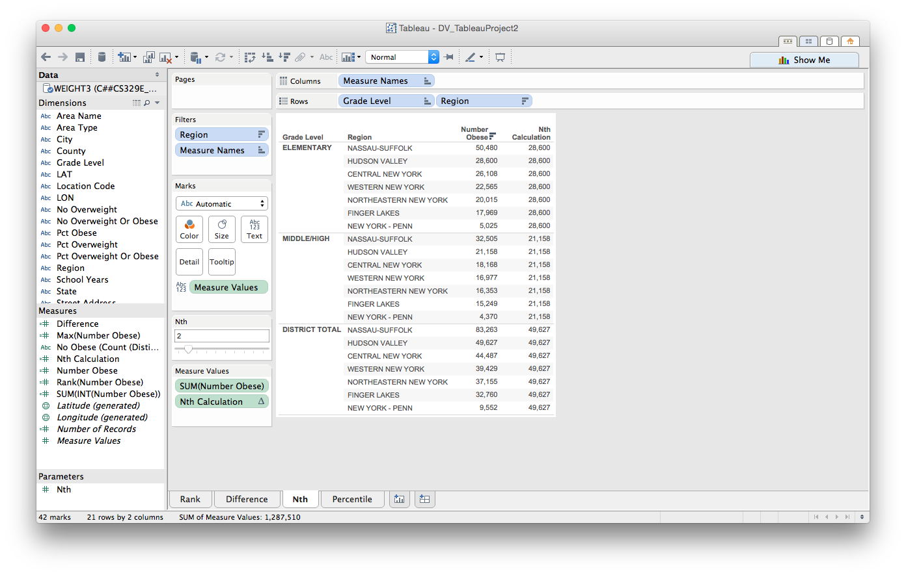

CS 329E Data Visualization - DV_TableauProject2
===
**For this project, we use in-depth government census data that focuses on student obesity/overweight rates from elementary to high schools within New York. We utilize SQL commands such as Partition By and rank() in order to display crosstabs in R which match crosstabs made from the same data in Tableau**

**Authors: Bruno De Hoyos (bd8739), Estevan Garza (eg22453)**

##Importing data frames:

We begin by importing some useful libraries:

```{r, warning=FALSE}
source("../01 SQL Crosstabs/lib.R", echo=TRUE, max.deparse.length=1e3)
```

##Rank

**Our first crosstab ranks the regions across New York which have the highest obesity rates. We make sure to group these regions by each grade level, and then by region, to keep the rankings separate using the PARTITION function in SQL.**

####SQL:
```{r}
source("../01 SQL Crosstabs/rank.R", echo=TRUE, max.deparse.length=1e3)
```
####Tableau:
 

##Difference

**The next crosstab involves displaying the difference in obesity numbers each region has, partitioned by grade level,from the whichever region has the respectively highest (max amount) rate of student obesity.**

####SQL:
```{r, echo=FALSE}
source("../01 SQL Crosstabs/rank.R", echo=TRUE, max.deparse.length=1e3)
```
####Tableau:
 

##Nth

**Our next crosstab displays the nth highest rate of obesity in a region given a grade level. In Tableau the nth slider bar allows the user to choose which tier of statistic he or she wants to see.**

####SQL:
```{r}
source("../01 SQL Crosstabs/rank.R", echo=TRUE, max.deparse.length=1e3)
```
####Tableau:
 

Note that the `echo = FALSE` parameter was added to the code chunk to prevent printing of the R code that generated the plot.**

##Percentile

**The last crosstab we reproduce involves displaying the cumulative distribution of obesity statistics across regions partitioned by grade level.**

####SQL:
```{r}
source("../01 SQL Crosstabs/rank.R", echo=TRUE, max.deparse.length=1e3)
```
####Tableau:
 


